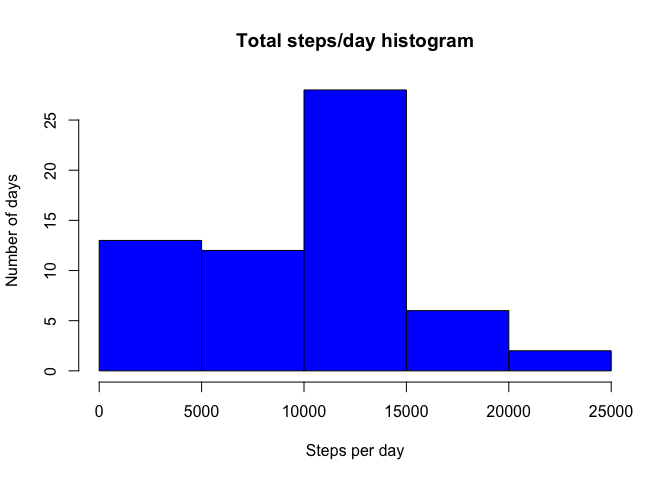
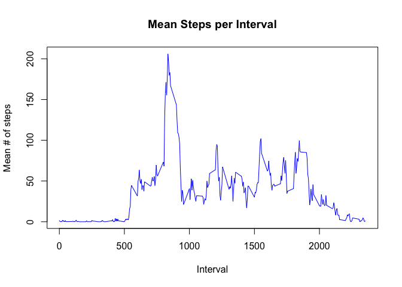
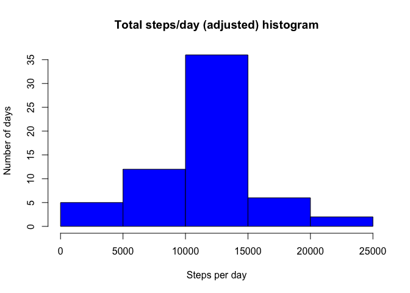
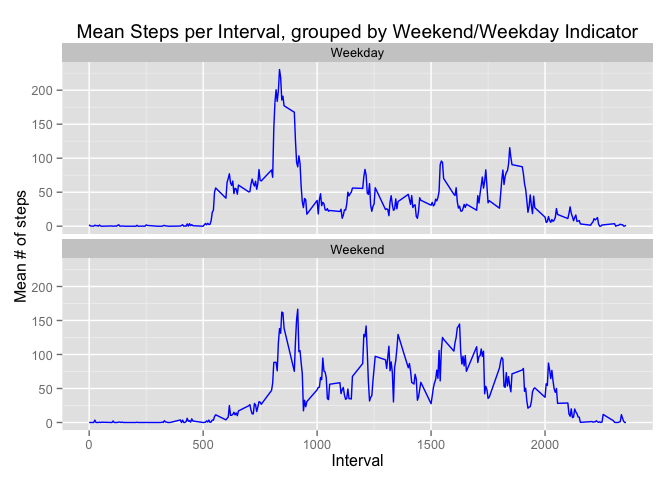

# Reproducible Research: Peer Assessment 1


## Loading and preprocessing the data


The file *activity.csv*, generated by extracting the provided zip file, is first read into a data frame for the processing required for the assessment.

## What is the mean total number of steps taken per day?

```r
# Calculate the total steps per day by summing the steps column by date
stepsSum <- setNames(aggregate(activityData$steps,by=list((activityData$date)),FUN=sum, na.rm=TRUE), c("date","totalSteps")) 
# Calculate mean and median, then generate histogram on the totalSteps column of the resulting data frame
meanTotalSteps <- mean(stepsSum$totalSteps)
medianTotalSteps <- median(stepsSum$totalSteps)
hist(stepsSum$totalSteps, xlab="Steps per day", ylab="Number of days", main="Total steps/day histogram", col="blue")
```

 

This histogram shows how total steps per day is distributed over the dates in the dataset. The **mean** of the total steps per day is 9354.23, while the **median** is 10395

## What is the the average daily activity pattern?

```r
# Calculate the mean of steps by each unique interval value.
intervalMean <- setNames(aggregate(activityData$steps,by=list((activityData$interval)),FUN=mean, na.rm=TRUE), c("interval","meanSteps"))
# Find which interval has the highest calulated mean, then plot the resulting set of means against the interval values
maxInterval <- intervalMean$interval[which.max(intervalMean$meanSteps)]
plot(intervalMean$interval,intervalMean$meanSteps,type="l", xlab="Interval", ylab="Mean # of steps", main="Mean Steps per Interval", col="blue")
```

 

This plot shows the mean number of steps for each unique interval in the data set. The interval with the **highest mean daily steps** is 835

## Imputing missing values

```r
# Calculate the total number of missing values in steps
missingStepsCount <- length(which(is.na(activityData$steps)))
# Helper function for filling in missing steps value
# Takes a row from the original dataset. If steps element is NA, retrieves the mean value of the corresponding
# interval (calculate in the previous step)
NAadjuster <- function(row) {
    if(is.na(row[1])) {
        c(intervalMean$meanSteps[which(intervalMean$interval == as.integer(row[3]))],row[2],row[3])
    }
    else {
        c(row[1],row[2],row[3])
    }
}
# Applies the helper function to the original dataset, then transforms it back to a manageable data frame
adjustedActivityData <- apply(activityData,1, NAadjuster)
adjustedActivityData <- as.data.frame(t(adjustedActivityData))
colnames(adjustedActivityData) <- c('steps','date','interval')
adjustedActivityData$steps <- as.integer(levels(adjustedActivityData$steps)[adjustedActivityData$steps])
adjustedActivityData$interval <- as.integer(levels(adjustedActivityData$interval)[adjustedActivityData$interval])
# Redo the histogram and mean/median on the adjusted data
adjustedStepsSum <- setNames(aggregate(adjustedActivityData$steps,by=list((adjustedActivityData$date)),FUN=sum, na.rm=TRUE), c("date","totalSteps"))
adjustedMeanTotalSteps <- mean(adjustedStepsSum$totalSteps)
adjustedMedianTotalSteps <- median(adjustedStepsSum$totalSteps)
meanDiff <- adjustedMeanTotalSteps - meanTotalSteps
medianDiff <- adjustedMedianTotalSteps - medianTotalSteps
hist(adjustedStepsSum$totalSteps, xlab="Steps per day", ylab="Number of days", main="Total steps/day (adjusted) histogram", col="blue")
```

 

The number of rows with an NA steps value in the original data set is 2304. The original dataset was adjusted by replacing NA values with the mean steps from the corresponding interval. This histogram shows how total steps per day is distributed over the dates in the adjusted dataset. The **mean** of the total steps per day for the adjusted data set is 10749.77, while the **median** is 10641. We can see that the overall number of steps per day has increased, because the higher numbers in the histogram for the adjusted data set have a higher count, while the **mean** has increased by 1395.541 and the **median** has increased by 246

## Are there differences in activity patterns between weekdays and weekends?

```r
suppressWarnings(library(ggplot2))
# Add additional variable to dataset that denotes if the associated date is a weekend or weekday, by
# checking if weekdays() return value is Saturday or Sunday
adjustedActivityData$dayIndicator <- factor(ifelse(weekdays(as.Date(adjustedActivityData$date)) %in% c("Saturday","Sunday"),"Weekend","Weekday"))
# Print a ggplot2 based line plot of mean steps by interval, facetted by the new dayIndicator variable
print(ggplot(adjustedActivityData, aes(x=interval, y=steps))
       + stat_summary(fun.y="mean", geom="line", color="blue")
       + facet_wrap(~ dayIndicator, nrow=2)
       + ylab("Mean # of steps")
       + xlab("Interval")
	     + ggtitle("Mean Steps per Interval, grouped by Weekend/Weekday Indicator"))
```

 

This plot shows the mean number of steps for each unique interval in the data set for both weekdays and weekends. We can see from this plot that weekdays have a higher peak steps value, while weekends have more steps distributed throughout the day.
